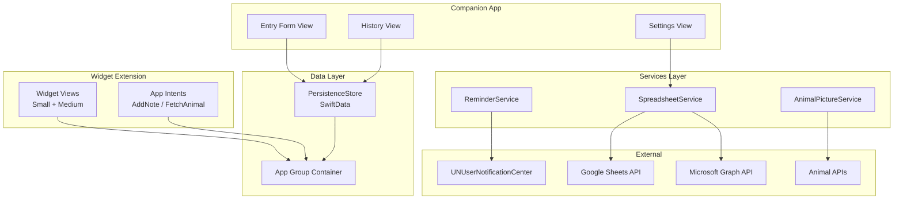
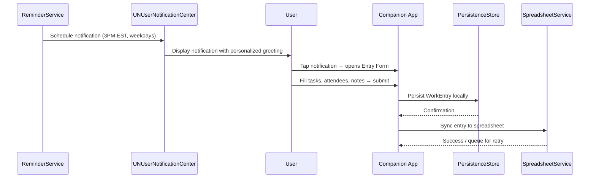

# Design Document: macOS Daily Work Widget

## Overview

This design describes a macOS native application composed of two targets: a **Companion App** (the host application) and a **Widget Extension** (WidgetKit-based). The Companion App manages scheduling, data entry, local persistence, and spreadsheet synchronization. The Widget Extension displays today's work summary and provides interactive buttons for ad-hoc note entry and fetching random animal pictures.

The application targets macOS 14.0+ (Sonoma) to leverage interactive widget capabilities introduced in that release — specifically, `Button` and `Toggle` support within WidgetKit views via App Intents.

### Key Technical Decisions

| Decision | Choice | Rationale |
|----------|--------|-----------|
| Local persistence | SwiftData (backed by SQLite) | Native Apple framework, integrates with SwiftUI, supports lightweight migrations |
| Notification scheduling | UNUserNotificationCenter with UNCalendarNotificationTrigger | Standard macOS API for time-based local notifications with weekday filtering |
| Spreadsheet auth | ASWebAuthenticationSession + manual REST calls | Avoids heavy Google SDK; works for both Google and Microsoft OAuth flows |
| Animal picture API | Multiple free APIs (randomfox.ca, random-d.uck.sh, Zoo Animals API) with fallback chain | No API key required, free, simple JSON response with image URL |
| Widget interactivity | App Intents framework | Required for interactive buttons in WidgetKit on macOS 14+ |
| Shared data between app and widget | App Groups container + SwiftData shared store | Standard mechanism for host app ↔ widget extension data sharing |

## Architecture

The application follows a layered architecture with clear separation between UI, business logic, and data/networking layers.



### Process Flow: Daily Reminder to Entry



## Components and Interfaces

### 1. ReminderService

Responsible for scheduling and managing the daily 3PM EST weekday notification.

```swift
protocol ReminderServiceProtocol {
    func scheduleWeekdayReminders() async throws
    func cancelAllReminders() async
    func handleDeliveryFailure(for date: Date) async
}

final class ReminderService: ReminderServiceProtocol {
    // Uses UNCalendarNotificationTrigger with DateComponents:
    // hour: 15, minute: 0, timeZone: TimeZone(identifier: "America/New_York")
    // Schedules 5 notifications (Mon-Fri) for the current/next week
    // Reschedules weekly via background app refresh or app launch
}
```

**Personalization**: Retrieves the user's first name via `NSFullUserName()`, splits on whitespace, and uses the first component. Falls back to "there" if empty.

### 2. PersistenceStore

Manages local storage of WorkEntry records using SwiftData within an App Group container.

```swift
protocol PersistenceStoreProtocol {
    func save(entry: WorkEntry) throws
    func fetchEntry(for date: Date) -> WorkEntry?
    func fetchAllEntries() -> [WorkEntry]
    func appendToEntry(date: Date, tasks: [String], attendees: [String], notes: [String]) throws
    func purgeExpiredEntries(retentionDays: Int) throws
}
```

### 3. SpreadsheetService

Handles OAuth authentication and row write/update operations for both Google Sheets and Microsoft Excel.

```swift
protocol SpreadsheetServiceProtocol {
    func configure(provider: SpreadsheetProvider, spreadsheetURL: URL) async throws
    func authenticate() async throws
    func writeEntry(_ entry: WorkEntry) async throws
    func updateEntry(_ entry: WorkEntry) async throws
    func retryPendingSync() async
}

enum SpreadsheetProvider {
    case googleSheets
    case microsoftExcel
}
```

**OAuth Flow**: Uses `ASWebAuthenticationSession` to open the provider's OAuth consent screen, receives the authorization code via a custom URL scheme callback, then exchanges for access/refresh tokens. Tokens are stored in the macOS Keychain.

**Retry Logic**: Failed sync operations are queued in the PersistenceStore with a `syncStatus` field. A background timer retries every 5 minutes, up to 3 attempts.

### 4. AnimalPictureService

Fetches random animal images from free public APIs.

```swift
protocol AnimalPictureServiceProtocol {
    func fetchRandomAnimalImage() async throws -> AnimalImage
}

struct AnimalImage {
    let url: URL
    let imageData: Data
}
```

**API Strategy**: Uses a fallback chain of free, no-auth-required APIs:
1. `https://randomfox.ca/floof/` — returns `{ "image": "url", "link": "url" }`
2. `https://random-d.uck.sh/api/random` — returns `{ "url": "image_url" }`
3. Zoo Animals API — returns animal data with image links

If all fail within 10 seconds, displays the fallback message.

### 5. Widget Views

```swift
struct DailyTrackerWidget: Widget {
    var body: some WidgetConfiguration {
        StaticConfiguration(kind: "DailyTrackerWidget", provider: DailyTrackerTimelineProvider()) { entry in
            DailyTrackerWidgetView(entry: entry)
        }
        .supportedFamilies([.systemSmall, .systemMedium])
        .configurationDisplayName("Daily Work Tracker")
        .description("View today's logged work and quick actions.")
    }
}
```

**Small Widget Layout**:
- Current date
- Task count / Meeting count
- Add-note button (App Intent)
- Animal picture button (App Intent)

**Medium Widget Layout**:
- All of small layout content
- Up to 3 task descriptions (truncated to 40 characters with ellipsis)
- Notes indicator

### 6. App Intents (Interactive Widget Actions)

```swift
struct AddNoteIntent: AppIntent {
    static var title: LocalizedStringResource = "Add Note"
    func perform() async throws -> some IntentResult {
        // Opens the Companion App with the note entry form
    }
}

struct FetchAnimalIntent: AppIntent {
    static var title: LocalizedStringResource = "Fetch Animal"
    func perform() async throws -> some IntentResult {
        // Triggers animal image fetch, updates widget timeline
    }
}
```

### 7. NotificationDelegate

Handles notification tap actions to open the Entry Form.

```swift
final class NotificationDelegate: NSObject, UNUserNotificationCenterDelegate {
    func userNotificationCenter(_ center: UNUserNotificationCenter,
                                didReceive response: UNNotificationResponse) async {
        // Open Entry Form in Companion App
    }
}
```

## Data Models

### WorkEntry

```swift
@Model
final class WorkEntry {
    @Attribute(.unique) var id: UUID
    var date: Date                      // Calendar date (day precision)
    var tasks: [String]                 // Up to 20 items, each ≤ 500 chars
    var attendees: [String]             // Up to 30 items, each ≤ 100 chars
    var notes: [String]                 // Chronologically ordered
    var createdAt: Date
    var updatedAt: Date
    var syncStatus: SyncStatus

    enum SyncStatus: String, Codable {
        case pending
        case synced
        case failed
        case retrying
    }
}
```

### SpreadsheetConfig

```swift
@Model
final class SpreadsheetConfig {
    var provider: String                // "googleSheets" or "microsoftExcel"
    var spreadsheetURL: String
    var sheetName: String?
    var lastSyncDate: Date?
}
```

### AnimalImageCache

```swift
struct AnimalImageCache {
    var imageData: Data?
    var fetchedAt: Date?
    var sourceURL: URL?
}
```

### Spreadsheet Row Format

| Column | Content | Format |
|--------|---------|--------|
| A | Date | ISO 8601 (YYYY-MM-DD) |
| B | Completed Tasks | Newline-separated list |
| C | Meeting Attendees | Comma-separated |
| D | Notes | Newline-separated, chronological |

## Correctness Properties

*A property is a characteristic or behavior that should hold true across all valid executions of a system — essentially, a formal statement about what the system should do. Properties serve as the bridge between human-readable specifications and machine-verifiable correctness guarantees.*

### Property 1: Work entry validation rejects empty submissions

*For any* Entry Form submission where both the tasks list and the attendees list are empty (regardless of notes content), the system SHALL reject the submission and leave the persisted data unchanged.

**Validates: Requirements 2.5**

### Property 2: Ad-hoc note validation rejects whitespace-only input

*For any* string composed entirely of whitespace characters (spaces, tabs, newlines), submitting it as an ad-hoc note SHALL be rejected, and the Work_Entry for the current date SHALL remain unchanged.

**Validates: Requirements 3.5**

### Property 3: Work entry append preserves existing data

*For any* existing Work_Entry and any valid new submission (tasks, attendees, notes), appending the new data to the existing entry SHALL result in a Work_Entry that contains all original tasks, attendees, and notes plus all new tasks, attendees, and notes, with no data lost or reordered.

**Validates: Requirements 2.6**

### Property 4: Ad-hoc note chronological ordering

*For any* sequence of ad-hoc notes submitted throughout a day, the resulting Work_Entry's notes array SHALL be ordered chronologically — i.e., for all indices i < j, notes[i] was submitted before notes[j].

**Validates: Requirements 3.3**

### Property 5: Spreadsheet row serialization round-trip

*For any* valid Work_Entry, serializing it to the spreadsheet row format (date, tasks, attendees, notes) and then parsing that row back SHALL produce an equivalent Work_Entry with the same date, tasks, attendees, and notes.

**Validates: Requirements 4.3**

### Property 6: Retention policy correctly purges old entries

*For any* set of Work_Entry records with varying creation dates, running the purge operation with a 90-day retention period SHALL delete exactly those entries whose creation date is more than 90 days ago, and SHALL preserve all entries within the retention window.

**Validates: Requirements 6.3, 6.4**

### Property 7: Notification scheduling targets only weekdays

*For any* set of scheduled notification triggers produced by the ReminderService, every trigger's date components SHALL correspond to a weekday (Monday through Friday) and none SHALL correspond to Saturday or Sunday.

**Validates: Requirements 1.1, 1.2**

### Property 8: Widget summary counts match entry data

*For any* Work_Entry, the widget summary display SHALL show a task count equal to the length of the entry's tasks array and a meeting count equal to the length of the entry's attendees array.

**Validates: Requirements 7.1**

### Property 9: Task and attendee field length constraints

*For any* input, the system SHALL accept tasks only if each task is ≤ 500 characters and the total count is ≤ 20, and attendees only if each name is ≤ 100 characters and the total count is ≤ 30. Any input exceeding these bounds SHALL be rejected.

**Validates: Requirements 2.3, 2.4**

### Property 10: Personalized notification name extraction

*For any* non-empty full name string, extracting the first name by splitting on whitespace and taking the first component SHALL produce a non-empty string used in the notification body. For any empty or nil input, the system SHALL fall back to the generic greeting.

**Validates: Requirements 10.1, 10.2, 10.3**

## Error Handling

### Notification Delivery Failures

| Scenario | Handling |
|----------|----------|
| Initial delivery fails | Retry once within 5 minutes using a delayed UNNotificationRequest |
| Retry also fails | Log failure (os_log), suppress further attempts until next weekday |
| User denies notification permission | Display in-app banner explaining the feature requires permissions, provide button to open System Settings |

### Persistence Failures

| Scenario | Handling |
|----------|----------|
| SwiftData write fails | Display error alert, retain form data in memory, allow retry |
| SwiftData read fails on launch | Display error state, allow user to create new entries (degraded mode) |
| App Group container inaccessible | Fall back to app-local container, log warning |

### Spreadsheet Sync Failures

| Scenario | Handling |
|----------|----------|
| Network error on write | Mark entry as `syncStatus: .retrying`, retry at 5-min intervals |
| 3 retries exhausted | Mark as `.failed`, send persistent notification to user |
| Token expired (401) | Prompt re-authentication via ASWebAuthenticationSession |
| Spreadsheet not found (404) | Prompt user to reconfigure spreadsheet URL |

### Animal Picture Failures

| Scenario | Handling |
|----------|----------|
| Primary API timeout (10s) | Try next API in fallback chain |
| All APIs fail | Display "Image unavailable" message in widget, retain fetch button |
| Image data corrupted | Treat as failure, try next API |

## Testing Strategy

### Unit Tests

- **ReminderService**: Verify scheduling logic produces correct DateComponents for weekdays only; verify personalized name extraction from various full name formats (single name, multi-part, empty, nil)
- **PersistenceStore**: Verify CRUD operations, append behavior, purge logic with mock dates
- **SpreadsheetService**: Verify row serialization format, retry queue management (mock network)
- **AnimalPictureService**: Verify URL parsing from each API response format, fallback chain behavior (mock URLSession)
- **WorkEntry validation**: Verify acceptance/rejection of various input combinations
- **Widget timeline**: Verify summary counts match entry data

### Property-Based Tests

Property-based testing is well-suited to this project for validating data transformation logic, validation rules, and serialization. The following library and configuration will be used:

- **Library**: [swift-testing](https://github.com/apple/swift-testing) with a custom property testing helper using `SwiftCheck` or a lightweight randomized test runner
- **Minimum iterations**: 100 per property test
- **Tag format**: `Feature: macos-daily-work-widget, Property {number}: {property_text}`

Each correctness property (1-10) above maps to a property-based test that generates random valid/invalid inputs and asserts the universal property holds.

### Integration Tests

- **OAuth flow**: Manual test with real Google/Microsoft accounts (not automated)
- **Spreadsheet write**: Integration test writing to a test spreadsheet (run on-demand, not CI)
- **Notification delivery**: Manual verification on macOS (notifications cannot be programmatically verified)
- **Widget rendering**: Xcode Previews + manual visual inspection across both size families

### Test Organization

```
Tests/
├── UnitTests/
│   ├── ReminderServiceTests.swift
│   ├── PersistenceStoreTests.swift
│   ├── SpreadsheetServiceTests.swift
│   ├── AnimalPictureServiceTests.swift
│   ├── WorkEntryValidationTests.swift
│   └── WidgetTimelineTests.swift
├── PropertyTests/
│   ├── ValidationPropertyTests.swift
│   ├── SerializationPropertyTests.swift
│   ├── PersistencePropertyTests.swift
│   ├── ReminderSchedulingPropertyTests.swift
│   └── NameExtractionPropertyTests.swift
└── IntegrationTests/
    └── SpreadsheetSyncIntegrationTests.swift
```
